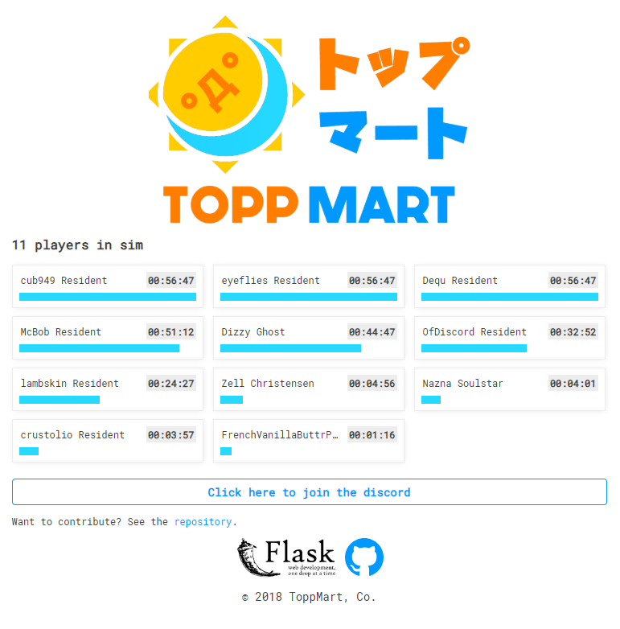

# Toppmart Website

A `Flask`, `SQLAlchemy` and `AngularJS` app to collect stats about ToppMart (namely, which players are in the sim).



# Setup

```
pip install flask
pip install Flask-SQLAlchemy
```

Make sure you generate your `sqlite3` database file using `db.create_all` in the app context.

# Production mode

```
export FLASK_APP=app/app.py
export FLASK_ENV=production
flask run --host=0.0.0.0 --port=80
```

Then navigate to `<ipaddress>:80` in your browser.

# How it works

Data is sent to the server through a POST request from Second Life to the `/sim/dump` endpoint. Data is formatted as a colon separated list of player names (ex. `user1:user2:user3`).